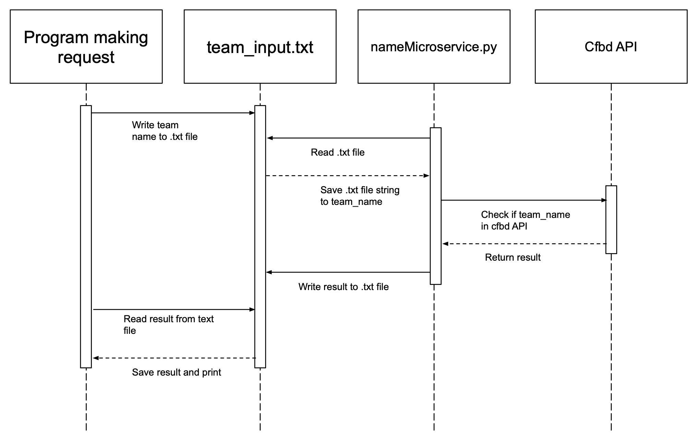

Communication Contract:
1. For which teammate did you implement “Microservice A”?
    - Brenton Wooley

2. What is the current status of the microservice? Hopefully, it’s done!
    - The microservice is complete

3. If the microservice isn’t done, which parts aren’t done and when will they be done?
    - No problems

4. How is your teammate going to access your microservice? Should they get your code from GitHub (if so, provide a link to your public or private repo)? Should they run your code locally? Is your microservice hosted somewhere? Etc.
    - Access through the microservice can be run locally and pulled from this GitHub repository: https://github.com/tcarlyle14/CollegeFootballStats
    - The microservice file is called nameMicroservice.py and the txt file is called team_input.txt

5. If your teammate cannot access/call YOUR microservice, what should they do? Can you be available to help them? What’s your availability?
    - If my teammate cannot access/call my microservice, they can contact me on discord or teams. From there we can set up a meeting to troubleshoot. I am available anytime 10am-10pm EST.

6. If your teammate cannot access/call your microservice, by when do they need to tell you?
    - If they cannot access/call my microservice they should notify me by EOD 11/23/23, 48 hours before the due date to S3.6 - Discussion: "Microservice A" Validation, Code Review (due EOD 11/25/24).

7. Is there anything else your teammate needs to know? Anything you’re worried about? Any assumptions you’re making? Any other mitigations / backup plans you want to mention or want to discuss with your teammate?
    - The microservice utilizes the college football stats API.

How to programmatically REQUEST data from the microservice:

    - To request data from the microservice, you would write the input team name as a string to the txt file team_input.txt. The microservice then reads the team name, checks if the team name is in the cfbd API, and returns True or False.
    - Example call:
    with open("team_input.txt", "w") as file:
        file.write(team_name)

How to programmatically RECEIVE data from the microservice:

    - To receive data from the microservice, you would read the True or False string returned from the microservice to the txt file team_input.txt to know if a orginal input team name is valid.
    - Example call:
    with open("team_input.txt", "r") as file:
        result = file.read().strip().lower()

UML Sequence Diagram:
